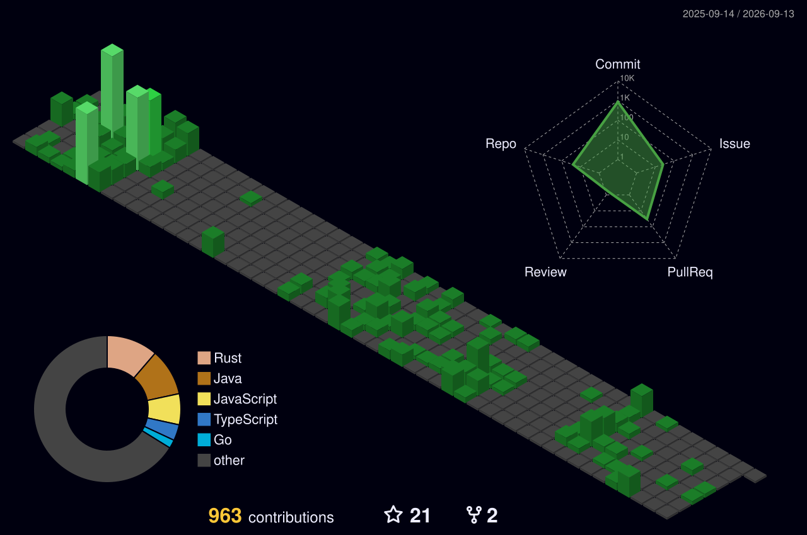

<!-- ███████████████████████████████████████████████████████████████████ -->
<!-- ██  PRATHAM PARIKH | @pratham15541 | RETRO TERMINAL README v3  ██ -->
<!-- ███████████████████████████████████████████████████████████████████ -->


<!-- ░░░░░░░░░░░░░░░░░░░░░░░░░░░░░░░░░░░░░░░░░░░░░░░░░░░░░ -->
<!--                  BIOS POST — BOOT SEQUENCE               -->
<!-- ░░░░░░░░░░░░░░░░░░░░░░░░░░░░░░░░░░░░░░░░░░░░░░░░░░░░░ -->

<div align="center">

```
╔══════════════════════════════════════════════════════════════════╗
║                                                                  ║
║   PRATHAM-OS  v2.0.26  [BIOS ROM v1.0]                          ║
║   Copyright (C) 1999-2026  Pratham Parikh Inc.  All Rights Res.  ║
║                                                                  ║
╠══════════════════════════════════════════════════════════════════╣
║                                                                  ║
║   CPU ...... Software Engineer @ ∞ GHz                           ║
║   RAM ...... 640K OK  (We'll need more for those containers)     ║
║   GPU ...... Retro Shader v42.0 — CRT Phosphor Mode ENABLED     ║
║   DISK ..... /dev/creativity ............... [MOUNTED]           ║
║   NET ...... github.com/pratham15541 ....... [CONNECTED]         ║
║                                                                  ║
║   [✓] POST diagnostics ......................... OK              ║
║   [✓] Loading kernel modules ................... OK              ║
║   [✓] Mounting /dev/creativity ................. OK              ║
║   [✓] Starting debug daemon .................... OK              ║
║   [✓] Initializing neural networks ............. OK              ║
║   [✓] Brewing caffeine ......................... OK              ║
║   [✓] Compiling mass ambition .................. OK              ║
║                                                                  ║
║   ░▒▓████████████████████████████████████████▓▒░  100% READY    ║
║                                                                  ║
╚══════════════════════════════════════════════════════════════════╝
```

</div>

<!-- ░░░░░░░░░░░░░░░░░░░ TYPING BANNER ░░░░░░░░░░░░░░░░░░░ -->

<!-- <div align="center">

[](https://git.io/typing-svg)

</div> -->

<!-- ░░░░░░░░░░░░░░░ DYNAMIC BADGES ░░░░░░░░░░░░░░░░░ -->

<div align="center">


&nbsp;
[](https://github.com/pratham15541)
&nbsp;
[](https://github.com/pratham15541)
&nbsp;

&nbsp;


</div>

<div align="center">

</div>

<!-- ░░░░░░░░░░░░░░░░ SYSTEM INFORMATION ░░░░░░░░░░░░░░░░░ -->

<div align="center">

[](https://git.io/typing-svg)

</div>

<div align="center">

```
╔══════════════════════════════════════════════════════════════════╗
║                     ◄ SYSTEM INFORMATION ►                       ║
╠═══════════════════╦══════════════════════════════════════════════╣
║  USER             ║  Pratham Parikh  (He/Him)                    ║
║  CLASS            ║  Software Engineer                           ║
║  ROLE             ║  Full-Stack Dev · DevOps · FOSS Contributor  ║
║  OS               ║  Linux / Cloud Native                        ║
║  SHELL            ║  zsh + tmux + neovim                         ║
║  UPTIME           ║  Always compiling...                         ║
║  STATUS           ║  ● ONLINE — Building cool stuff              ║
╠═══════════════════╬══════════════════════════════════════════════╣
║  QUEST            ║  Building the future, one commit at a time   ║
║  PHILOSOPHY       ║  "Writing code is creativity,                ║
║                   ║   debugging is mastery."                     ║
╠═══════════════════╬══════════════════════════════════════════════╣
║  STR  ████████████████████░░░░  85%  [Backend & Systems]         ║
║  DEX  ██████████████████░░░░░░  78%  [Frontend & UI/UX]          ║
║  INT  █████████████████████░░░  90%  [Problem Solving]           ║
║  WIS  ███████████████████░░░░░  82%  [Architecture]              ║
║  CHA  █████████████████░░░░░░░  75%  [Open Source]               ║
╚═══════════════════╩══════════════════════════════════════════════╝
```

</div>

<div align="center">

</div>

<!-- ░░░░░░░░░░░░░░░░░░░ ABOUT ME ░░░░░░░░░░░░░░░░░░░░░ -->

<details open>
<summary><b>
  
</b></summary>
<br>

<div align="center">

|                |                                                             |
| -------------- | ----------------------------------------------------------- |
| **Who am I**   | Software Engineer building the future, one commit at a time |
| **Languages**  | JavaScript, TypeScript, Python, Go, C++               |
| **Specialty**  | Full-Stack Development · DevOps · Cloud Architecture        |
| **Philosophy** | _"Writing code is creativity, debugging is mastery."_       |
| **Interests**  | Systems Programming · Distributed Systems · Open Source     |
| **Fun Fact**   | I debug with `console.log` and I'm not ashamed              |

</div>

<br>

```
┌──────────────────────────────────────────────────────────────────────┐
│                                                                      │
│   > Full-Stack Developer who speaks JS, Python & Cpp fluently        │
│   > DevOps engineer who treats infrastructure as code                │
│   > Open-Source contributor — I fix bugs no one else dares to        │
│   > Competitive programmer: Codeforces · LeetCode · AtCoder          │
│   > Cloud-native builder on AWS / GCP / Azure                        │
│   > Currently exploring: systems programming & distributed systems   │
│                                                                      │
└──────────────────────────────────────────────────────────────────────┘
```

</details>

<div align="center">

</div>

<!-- ░░░░░░░░░░░░░ CURRENTLY WORKING ON ░░░░░░░░░░░░░░░ -->

<div align="center">

[](https://git.io/typing-svg)

</div>

<div align="center">

```
╔═══════════════════════════════════════════════════════╗
║              ◄ ACTIVE PROCESSES ►                     ║
╠═══════════════════════════════════════════════════════╣
║                                                       ║
║  PID   PROCESS              STATUS        CPU         ║
║  ───   ─────────────────    ──────────    ────        ║
║  001   Learning Go           ● RUNNING     92%        ║
║  002   Building Side Proj    ● RUNNING     87%        ║
║  003   Open Source Contrib   ● RUNNING     75%        ║
║  004   Competitive Prog      ○ SLEEPING    15%        ║
║  005   Drinking Coffee       ● RUNNING     99%        ║
║                                                       ║
╚═══════════════════════════════════════════════════════╝
```

</div>

<div align="center">

</div>

<!-- ░░░░░░░░░░░░░░░░░░ TECH STACK ░░░░░░░░░░░░░░░░░░░░ -->

<div align="center">

[](https://git.io/typing-svg)

</div>

<details open>
<summary><b><code>〔 LANGUAGES 〕</code></b> — <i>click to expand/collapse</i></summary>
<br>
<div align="center">


<!--  -->


</div>
</details>

<details open>
<summary><b><code>〔 FRONTEND 〕</code></b> — <i>click to expand/collapse</i></summary>
<br>
<div align="center">


</div>
</details>

<details open>
<summary><b><code>〔 DEVOPS & CLOUD 〕</code></b> — <i>click to expand/collapse</i></summary>
<br>
<div align="center">


<!--  -->
<!--  -->
<!--  -->


</div>
</details>

<details open>
<summary><b><code>〔 DATABASES 〕</code></b> — <i>click to expand/collapse</i></summary>
<br>
<div align="center">


</div>
</details>

<details open>
<summary><b><code>〔 COMPETITIVE PROGRAMMING 〕</code></b> — <i>click to expand/collapse</i></summary>
<br>
<div align="center">

[](https://codeforces.com/profile/pratham15541)
[](https://leetcode.com/pratham15541)
[](https://atcoder.jp/users/pratham15541)

</div>
</details>

<div align="center">

</div>

<!-- ░░░░░░░░░░░░░░░░ GITHUB STATS ░░░░░░░░░░░░░░░░░░░ -->

<div align="center">

[](https://git.io/typing-svg)

</div>

<div align="center">


</div>

<br>

<div align="center">


</div>

<div align="center">

</div>

<!-- ░░░░░░░░░░░░░░░░ TROPHIES ░░░░░░░░░░░░░░░░░░░░░ -->

<div align="center">

[](https://git.io/typing-svg)

</div>

<div align="center">

[](https://github.com/ryo-ma/github-profile-trophy)

</div>

<div align="center">

</div>

<!-- ░░░░░░░░░░░░░░░ ACTIVITY GRAPH ░░░░░░░░░░░░░░░░░░ -->

<div align="center">

[](https://git.io/typing-svg)

</div>

<div align="center">


</div>

<div align="center">

</div>

<!-- ░░░░░░░░░░░░░░░ 3D CONTRIBUTION GLOBE ░░░░░░░░░░░░░░░ -->

<details open>
<summary><b>
  
</b> — <i>click to expand/collapse</i></summary>
<br>

<div align="center">

<a href="https://github.com/yoshi389111/github-profile-3d-contrib">
  
</a>

</div>

</details>

<div align="center">

</div>

<!-- ░░░░░░░░░░░░░░░ SNAKE ANIMATION ░░░░░░░░░░░░░░░░░░ -->

<div align="center">

[](https://git.io/typing-svg)

</div>

<div align="center">

<picture>
  <source media="(prefers-color-scheme: dark)" srcset="https://raw.githubusercontent.com/pratham15541/pratham15541/output/github-contribution-grid-snake-dark.svg" />
  <source media="(prefers-color-scheme: light)" srcset="https://raw.githubusercontent.com/pratham15541/pratham15541/output/github-contribution-grid-snake.svg" />
  
</picture>

</div>

<div align="center">

</div>

<!-- ░░░░░░░░░░░░░░░ SOCIAL LINKS ░░░░░░░░░░░░░░░░░░░░ -->

<div align="center">

[](https://git.io/typing-svg)

</div>

<div align="center">

```
  ╔═══════════════════════════════════════════╗
  ║    PORT    SERVICE         STATUS         ║
  ╠═══════════════════════════════════════════╣
  ║    :443    Twitter/X       ● CONNECTED    ║
  ║    :443    LinkedIn        ● CONNECTED    ║
  ║    :443    Instagram       ● CONNECTED    ║
  ║    :443    Discord         ● CONNECTED    ║
  ║    :443    Dev.to          ● CONNECTED    ║
  ╚═══════════════════════════════════════════╝
```

</div>

<div align="center">

[](https://twitter.com/pratham15541)
[](https://linkedin.com/in/pratham-parikh)
[](https://instagram.com/pratham15541)
[](https://discord.com/users/pratham15541)
[](https://dev.to/pratham15541)

</div>

<div align="center">

</div>

<!-- ░░░░░░░░░░░░░░░ DEV QUOTE ░░░░░░░░░░░░░░░░░░░░░ -->

<div align="center">

[](https://git.io/typing-svg)

```
  _______________________________________________
 /                                               \
|  "Writing code is creativity,                   |
|   debugging is mastery."                        |
 \_______________________________________________/
        \   ^__^
         \  (oo)\_______
            (__)\       )\/\
                ||----w |
                ||     ||
```

</div>

<div align="center">

[](https://github.com/piyushsuthar/github-readme-quotes)

</div>

<div align="center">

</div>

<!-- ░░░░░░░░░░░░░░░ EASTER EGG ░░░░░░░░░░░░░░░░░░░░ -->

<details>
<summary><b><code>C:\Pratham> cat /dev/secret</code> 👈 click me if you dare</b></summary>
<br>

<div align="center">

```
┌──────────────────────────────────────────────┐
│                                              │
│   YOU FOUND THE SECRET TERMINAL!             │
│                                              │
│   > You must be a curious developer.         │
│   > That's a great quality.                  │
│   > Here's a cookie: 🍪                      │
│                                              │
│   fun facts:                                 │
│   ├── mass caffeine consumer ☕               │
│   ├── mass late-night debugger 🌙            │
│   ├── mass git commit --amend user 🔄        │
│   ├── mass "it works on my machine" sayer 🐳 │
│   └── mass rubber duck debugger 🦆           │
│                                              │
│   > Now close this and star the repo. 😉     │
│                                              │
└──────────────────────────────────────────────┘
```

</div>

</details>

<div align="center">

</div>

<!-- ░░░░░░░░░░░░░░░░░ METRICS ░░░░░░░░░░░░░░░░░░░░░░ -->

<details>
<summary><b><code>$ cat /proc/github_metrics</code></b> — <i>click for deep metrics</i></summary>
<br>

<div align="center">


</div>

</details>

<div align="center">

</div>

<!-- ░░░░░░░░░░░░░░░░░ FOOTER ░░░░░░░░░░░░░░░░░░░░░ -->

<div align="center">

[](https://git.io/typing-svg)

```dos
C:\Pratham> shutdown /s /t 0 /message "Thanks for visiting!"

╔══════════════════════════════════════════════════════════════════╗
║                                                                  ║
║   > Session terminated.                                          ║
║   > All processes stopped.                                       ║
║   > Memory freed: 640K reclaimed.                                ║
║   > Contributions saved to disk.                                 ║
║                                                                  ║
║   > Thank you for visiting PRATHAM-OS.                           ║
║   > Until next commit...                                         ║
║                                                                  ║
║                    [ C:\Pratham> █ ]                              ║
║                                                                  ║
╚══════════════════════════════════════════════════════════════════╝
```

</div>

<div align="center">


</div>

<div align="center">

**If you liked this profile, consider giving it a ⭐!**

  <a href="https://github.com/pratham15541">
    
  </a>

</div>

<!-- Made with 💚 and mass caffeine by Pratham Parikh | @pratham15541 -->
